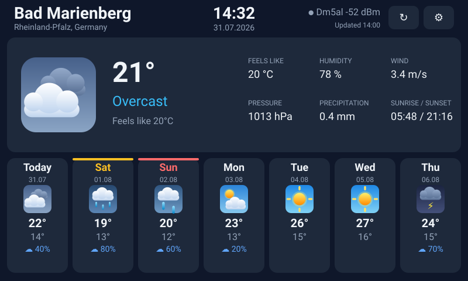

# ESP32-S3 Weather Station

A touch weather station for the **Waveshare ESP32-S3-Touch-LCD-7** (800×480 IPS,
capacitive touch). It finds its own location from the public IP address, pulls
current conditions and a 7-day forecast from Open-Meteo, and refreshes itself
every 15 minutes.

No API keys, no accounts, no cloud service to sign up for.

[](LICENSE)




<sub>Rendered from the firmware's own layout constants — not a photograph.
More in **[docs/SCREENS.md](docs/SCREENS.md)**.</sub>

## Features

- **Three languages** — English, Russian and German, switchable on the settings
  screen and remembered across reboots.
- **Automatic location** — resolved over IP (ipapi.co, falling back to
  ip-api.com), then cached in NVS so a provider outage does not blank the screen.
- **Clock** — SNTP-synced, shown in the header in the location's local time.
- **Current conditions** — temperature, apparent temperature, humidity, wind,
  surface pressure, precipitation, sunrise/sunset.
- **7-day forecast** — high/low, conditions and precipitation probability per day.
- **Days off marked** — weekends and regional public holidays are flagged on the
  forecast, with the holiday's local name.
- **On-screen Wi-Fi setup** — scans, lists networks by signal strength, and takes
  the password on a touch keyboard. Credentials are stored in NVS and only after
  the connection actually succeeds, so a typo cannot overwrite a working network.
- **Tear-free rendering** — LVGL draws straight into the RGB peripheral's two
  PSRAM frame buffers and page-flips on vsync.
- **Animated weather icons** — glyphs are composed from gradient-filled LVGL
  primitives, so they scale to any size and cost no flash. The large icon
  animates: rain falls, clouds drift, lightning strikes.
- **Metric and European** — dates as `31.07`, wind in m/s, 24-hour clock.

## Screens

| | |
|---|---|
| [Weather screen](docs/SCREENS.md#weather-screen) | current conditions, 7-day forecast, clock |
| [Days off](docs/SCREENS.md#days-off-with-a-public-holiday) | weekends and regional public holidays marked |
| [Network picker](docs/SCREENS.md#network-picker) | scan, pick, on-screen keyboard |
| [Settings](docs/SCREENS.md#settings) | language and network |

## Hardware

| | |
|---|---|
| Board | Waveshare ESP32-S3-Touch-LCD-7 |
| MCU | ESP32-S3R8 — 8 MB octal PSRAM |
| Flash | 8 MB (see note below) |
| Panel | 800×480 IPS, 16-bit RGB565 parallel |
| Touch | GT911 capacitive, I2C `0x5D` |
| Expander | CH422G on the same I2C bus |

> **Flash size.** This project is configured for the **8 MB** variant, verified
> against the attached board. If `esptool.py flash_id` reports 16 MB on yours,
> change `CONFIG_ESPTOOLPY_FLASHSIZE_8MB` to `..._16MB` in `sdkconfig.defaults`,
> delete `sdkconfig`, and rebuild.

### Pin map

Taken from the Waveshare schematic; all of it lives in `main/bsp/board.c`.

| Signal | GPIO |
|---|---|
| HSYNC / VSYNC / DE / PCLK | 46 / 3 / 5 / 7 |
| B3–B7 | 14, 38, 18, 17, 10 |
| G2–G7 | 39, 0, 45, 48, 47, 21 |
| R3–R7 | 1, 2, 42, 41, 40 |
| I2C SDA / SCL | 8 / 9 |
| Touch INT | 4 |

CH422G outputs (silkscreen `EXIO<n>` is the chip's `IO<n>`, so EXIO1 is bit 1):

| Pin | Function |
|---|---|
| EXIO1 | Touch reset |
| EXIO2 | Panel DISP / backlight (on-off only, no PWM) |
| EXIO3 | LCD reset |
| EXIO4 | SD card chip select |
| EXIO5 | USB / CAN mux |

## Building

Requires ESP-IDF **v5.3 or newer** (developed against v5.5.4).

```bash
idf.py set-target esp32s3
```

```bash
idf.py build
```

```bash
idf.py -p COM14 flash monitor
```

Managed components (`lvgl/lvgl` 9.2, `espressif/esp_lvgl_port`,
`espressif/esp_lcd_touch_gt911`) are fetched automatically on the first build.

## First run

1. The panel comes up on the network picker and scans.
2. Tap your network; type the password on the on-screen keyboard and hit
   **Connect**. Open networks connect straight away.
3. Once connected it geolocates, fetches the forecast and switches to the
   weather screen. Credentials are saved, so later boots go straight there.

On the weather screen, the refresh button forces an update and the gear button
opens settings, where the language and network can be changed.

## Layout of the code

```
main/
  main.c              app task: owns all blocking work and the state machine
  bsp/
    board.c           RGB panel, GT911, LVGL bring-up; all pin definitions
    ch422g.c          CH422G expander driver on the i2c_master API
  net/
    wifi_manager.c    scan / connect / NVS credentials
    http_get.c        GET-to-buffer helper with TLS via the cert bundle
    geolocate.c       IP geolocation with fallback and NVS cache
    weather.c         Open-Meteo client, WMO code tables
  ui/
    i18n.c            translation table (en / ru / de) and weekday names
    ui.c              screen manager, palette, boot screen
    ui_wifi.c         network picker + password keyboard
    ui_weather.c      current conditions + 7-day forecast + clock
    ui_settings.c     language picker and network entry point
    weather_icon.c    animated weather glyphs built from LVGL primitives
    fonts/            generated faces with Cyrillic and Latin-1
```

### Threading

LVGL runs on its own task inside `esp_lvgl_port` and must never block. Widget
callbacks therefore do nothing but post a `ui_cmd_t` onto a queue; the app task
in `main.c` performs every slow operation (scan, geolocation, HTTP) and touches
LVGL only while holding `bsp_display_lock()`.

## Languages and fonts

The interface ships in English, Russian and German; switch on the settings
screen (gear icon, top right of the weather screen). The choice is stored in
NVS.

Every translation lives on one line of the `I18N_STRINGS` table in
`main/ui/i18n.h`, which generates both the `str_id_t` enum and the lookup table.
Adding a language means adding a column there plus a case in `i18n_lang_name()`.

LVGL's built-in Montserrat faces carry only ASCII and the symbol block, so they
cannot render Cyrillic or German umlauts. `main/ui/fonts/` holds the same
typeface rebuilt with Latin-1 and Cyrillic added, generated by:

```bash
./tools/gen_fonts.sh
```

That needs node (lv_font_conv is fetched by npx) and reads its source faces from
the LVGL component, so there is nothing to download. All eight faces together
cost about 127 KB of flash.

## Days off

Forecast cards carry a coloured stripe and a tinted weekday name when the day is
not a working day:

| | |
|---|---|
| Public holiday | red stripe, red weekday, holiday name underneath |
| Sunday | red stripe, red weekday |
| Saturday | amber stripe, amber weekday |

Holidays come from [date.nager.at](https://date.nager.at) — free, keyless, and
covering most of Europe. German holidays are largely a *Land* matter (Fronleichnam
is a holiday in Rheinland-Pfalz but a normal working day in Niedersachsen), so
entries are filtered by the ISO subdivision code that geolocation supplies —
`DE-RP` for Rheinland-Pfalz. Entries with no county list are nationwide and
always apply.

The name shown is the local one (`Christi Himmelfahrt`, not `Ascension Day`),
since that is what a regional calendar prints — it does **not** follow the
interface language.

If the lookup fails, or the country is one the service does not cover, weekends
are still marked and holidays simply go unflagged. Without a subdivision code
only nationwide holidays are kept, rather than claiming ones that may not apply
locally.

## Tuning the panel timings

The exact porch values for this panel are not published, and the figures in
circulation disagree by an order of magnitude (4 to 210). So the timings live in
NVS and are adjustable from the serial console — each change costs a reboot,
about a second, instead of a two-minute build-and-flash cycle.

```bash
idf.py -p COM14 monitor
```

| Command | Effect |
|---|---|
| `lcd` | show the values in use, plus htotal/vtotal and refresh rate |
| `lcd set hbp 40` | change one or more fields, save, reboot |
| `lcd set hbp 44 vbp 18` | several at once |
| `lcd reset` | forget the override, reboot on compiled defaults |
| `lcd grid on` | overlay the alignment pattern |

Fields: `pclk hpw hbp hfp vpw vbp vfp hpol vpol depol pclkneg`.

### Finding the right values

Turn on `lcd grid on`. It draws a 1px red frame on the outermost pixels, corner
brackets, a centre cross, and green ticks every 50px (taller every 100px).

- **All four red edges visible** → alignment is correct.
- **Clipped on the left, gap on the right** → picture is too far left:
  **increase `hbp`**.
- **Clipped on the right, gap on the left** → **decrease `hbp`**.
- Same logic vertically with `vbp`.
- Use the 50px ticks to count how many pixels out you are, then move `hbp` by
  that amount — the relationship is 1:1 in pixels.

Polarity (`hpol`/`vpol`) is worth trying only if the picture is wildly displaced
or unstable rather than cleanly offset; a uniform shift is almost always porch.
`pclkneg` shows up as colour fringing or shimmer, not as a shift.

Once it looks right, copy the numbers from `lcd show` into the
`LCD_TIMING_DEFAULT_*` macros in `main/bsp/lcd_timing.h` so a freshly flashed
board is correct without the NVS override.

## Troubleshooting

- **Why a hand-written CH422G driver?** The published
  `espressif/esp32_io_expander` port talks to the deprecated `driver/i2c.h`
  legacy driver. The GT911 shares that bus and is driven through the newer
  `i2c_master` API, and ESP-IDF will not bind both drivers to one port — so the
  expander had to speak the new API too. It is about 100 lines.
- **Pixel clock.** Defaults to 21 MHz (~47 Hz refresh at the current porches).
  If you see shimmer or torn lines, try `lcd set pclk 16` before anything else.
- **GT911 answers on I2C but never reports a touch?** Check the reset hold time.
  The address-select level on INT must be held for **≥50 ms after RST rises**,
  not before — that is when the controller samples it and finishes booting.
  Release INT too early and the chip still returns its product ID quite happily,
  but reports no touches. The tell is in the boot log:
  `TouchPad_Config_Version:0` means no configuration was loaded; a correct
  bring-up shows a non-zero version.
- **Screen shifted by a random amount that changes every reset?** Not a timing
  problem — porches are deterministic and would shift by the same amount each
  boot. It is the RGB DMA losing sync with the panel scan because it could not
  fetch frame-buffer data fast enough, which the ESP32-S3 turns into a
  *permanent* offset. The fix is bounce-buffer mode (`bblines`, on by default):
  the DMA feeds from internal SRAM and the driver restarts only when it detects
  a real underrun. If it persists, cut the PSRAM demand with `lcd set pclk 16`.
- **Picture stable but trembling?** That is `CONFIG_LCD_RGB_RESTART_IN_VSYNC`,
  which is why it is **deliberately off** here. It resets the GDMA on *every*
  VBlank; whenever that ISR runs late the LCD has already read the first bytes
  of the frame, so the restart re-sends them and that frame lands shifted. It
  trades an occasional permanent offset for a constant one. Bounce buffers are
  the better answer — leave this option off and let the underrun detector work.
- **Widget invisible after `lv_obj_set_pos()`?** Some LVGL widgets align
  themselves in their constructor — `lv_keyboard` does `LV_ALIGN_BOTTOM_MID`.
  Once aligned, `lv_obj_set_pos()` is an *offset from that anchor*, not an
  absolute position, so it can fling the widget off-screen. Use `lv_obj_align()`
  explicitly instead.
- **`CONFIG_SPIRAM_FETCH_INSTRUCTIONS` / `_RODATA` are deliberately off.**
  Enabling them puts instruction fetch on the same PSRAM bus the LCD DMA reads
  the frame buffer from, which is precisely the contention that starves it.

## Possible extensions

- Hourly forecast strip (Open-Meteo already exposes `hourly=`).
- Manual city override via `https://geocoding-api.open-meteo.com/v1/search`,
  useful when a VPN throws the IP geolocation off.
- Night dimming — note the DISP pin is on/off only, so real dimming needs the
  PWM-capable backlight mod.
- Unit switching (°F, hPa/inHg) alongside the language setting.

## How this was built

This project was developed collaboratively with an AI assistant (Anthropic's
Claude), working against the real board rather than from a datasheet alone.
Most of what is written down here — the CH422G driver-API clash, the GT911
reset hold time, the bounce-buffer pairing, the PSRAM bandwidth contention —
came out of that loop of flashing, reading the serial log and correcting a wrong
first guess.

Two things are worth stating plainly for anyone relying on this:

- **Confirmed on hardware:** panel bring-up and timings, GT911 touch, Wi-Fi
  setup and credential storage, IP geolocation, the Open-Meteo fetch, and the
  full boot-to-forecast path.
- **Not yet confirmed on hardware:** the public-holiday markings. The API
  response was validated offline, but no holiday has fallen inside a live
  forecast window yet.

## Licence and attribution

Open source under the MIT licence (`SPDX-License-Identifier: MIT`) — see
[LICENSE](LICENSE). Use it, change it, ship it commercially; just keep the
notice.

Services, none of which need an API key:

- Forecasts by [Open-Meteo](https://open-meteo.com/) (data CC BY 4.0).
- Public holidays by [date.nager.at](https://date.nager.at).
- Geolocation by [ipapi.co](https://ipapi.co/) and [ip-api.com](https://ip-api.com/).

Bundled font data in `main/ui/fonts/` is generated from typefaces shipped with
the LVGL component and stays under their original licences:

- **Montserrat** (Julieta Ulanovsky et al.) — SIL Open Font License 1.1.
- **Font Awesome Free 5** icon glyphs — SIL OFL 1.1 for the font data,
  CC BY 4.0 for the icon designs.

Regenerate them with `tools/gen_fonts.sh` rather than editing by hand.
