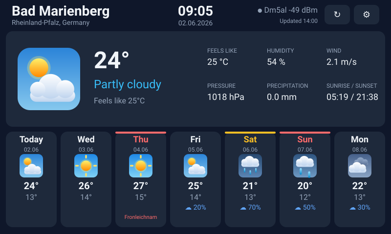
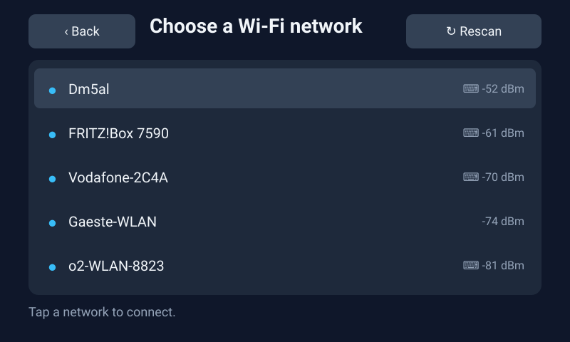
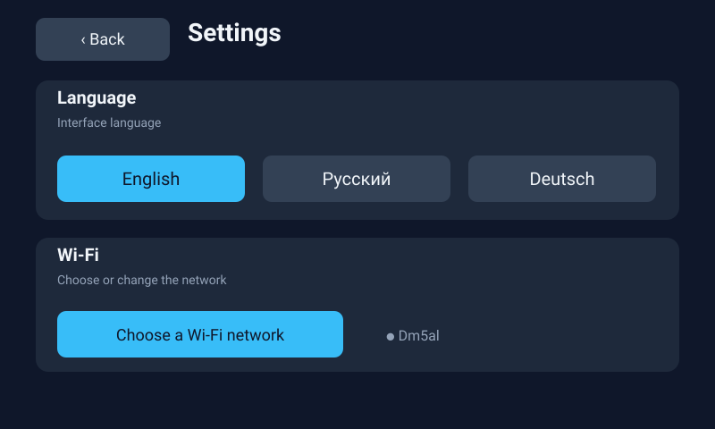

# Screens

> **These are rendered mockups, not photographs.** They are generated by
> [`tools/gen_mockups.py`](../tools/gen_mockups.py) from the same layout
> constants and palette the firmware uses (`main/ui/ui.h`, `ui_weather.c`,
> `weather_icon.c`), so they show what the code lays out — not what a camera
> saw on the panel. Colours and geometry are faithful; anti-aliasing, the
> Montserrat typeface and the idle animations are not reproduced here.
>
> Regenerate with `python tools/gen_mockups.py`.

## Weather screen

The default view, 800×480.

- **Header** — city and region on the left, SNTP clock and date centred, link
  status on the right, then refresh and settings buttons.
- **Current card** — animated condition icon on its tinted sky tile, temperature,
  condition text, and six readings: apparent temperature, humidity, wind (m/s),
  pressure, precipitation, and sunrise/sunset.
- **Forecast row** — seven days. `Today` is always first; the rest carry the
  short weekday and a `DD.MM` date.

Saturday is marked amber, Sunday red — the stripe along the top of the card and
the weekday name both change colour.

## Days off, with a public holiday

The same layout during a week containing **Fronleichnam** — a public holiday in
Rheinland-Pfalz but an ordinary working day in, say, Niedersachsen. The card is
marked in the same red as a Sunday and carries the holiday's local name.

Holidays are filtered by the ISO subdivision code that geolocation supplies, so
a board in a different *Bundesland* shows a different set. See
[Days off](../README.md#days-off).

## Network picker

Reached on first boot, or later from **Settings → Wi-Fi**. Networks are listed
strongest first and de-duplicated by SSID, so a mesh does not fill the list with
the same name. The keyboard glyph marks networks that need a password; tapping
one opens a full-screen prompt with an on-screen keyboard.

**Back** only appears once there is a weather screen to return to — during
first-run setup there is nothing behind it.

## Settings

Language switches take effect immediately; every screen is re-rendered in place,
including forecast weekdays and condition text. The choice is stored in NVS.

Language names are shown as endonyms — *Русский*, *Deutsch* — because a language
is easiest to find written in itself.
